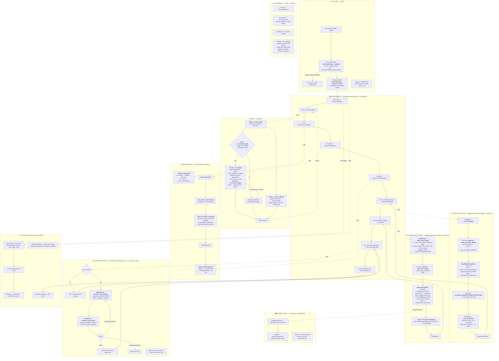

# DefPredict — System Pipeline (file-level data & logic flow)

This is the exact pipeline as implemented, stage by stage, with the source file and
function for every step and the data object that flows out of it.

## Data object evolution (the "json thing" as it mutates down the pipeline)

```
PDF bytes
  └─(parse)→        PDFDocument { pages: [PageContent{ text, tables:[ExtractedTable] }], toc }
  └─(skip+split)→   ParsedSection[]        # cover page + change-history dropped, re-cut by headings
  └─(group)→        ChunkGroup[]           # 5 sections per group  (deterministic, ceil(n/5))
  └─(extraction)→   IntermediateReport { sections:[SectionSummary], findings:[ExtractionFinding], consensus_notes }
  └─(detection)→    FlawReport { findings:[FlawFinding], consensus_summary, agents_participated }
  └─(correction)→   RecommendationSet { recommendations:[Correction], flaws_found, loop counts }
```

## Full flowchart



## Per-stage reference table

| # | Stage | File :: function | Input | Output | LLM? |
|---|-------|------------------|-------|--------|------|
| 0 | Upload | `api/routes/upload.py :: analyze` | PDF | `job_id`, spawns background task | no |
| 1 | Parse | `parse/pdf.py :: extract_pdf` (+ `ocr.py`) | PDF path | `PDFDocument` | RapidOCR (Databricks) for scanned pages |
| 2 | Classify | `parse/section_splitter.py :: classify_document` | `PDFDocument` | `CTDSection` | no (regex; LLM only as fallback in `classifier.py`) |
| 3 | Split | `parse/section_splitter.py :: split_document` | `PDFDocument` | `ParsedSection[]` | no |
| 4 | Group | `parse/section_splitter.py :: group_sections` | `ParsedSection[]` | `ChunkGroup[]` | **no — deterministic ceil(n/5)** |
| 5 | Extraction | `agents/extraction/group.py :: run_extraction` | `ChunkGroup[]` | `IntermediateReport` | yes (N agents + moderator, RoundRobin) |
| 5b | Anchor guard | `agents/extraction/anchor.py :: filter_anchored` | extract + source | pruned findings | no — deterministic |
| 6a | Select flaw types | `agents/detection/classifier.py :: select_flaw_types` | `IntermediateReport` | `list[str]` | **yes — LLM decides M agents** |
| 6b | Detection | `agents/detection/group.py :: run_flaw_detection` | `IntermediateReport` | `FlawReport` | yes (M agents + 70B moderator, Selector) |
| 6c | Structure findings | `..detection/group.py :: _extract_structured_findings` | consensus text | `FlawFinding[]` | yes |
| 7a | Suggest | `agents/correction/suggestor.py :: generate_corrections` | `FlawReport` | `Correction[]` | yes |
| 7b | Evaluate | `agents/correction/evaluator.py :: evaluate_corrections` | corrections | `Verdict` + feedback | yes |
| 7 | Correction loop | `agents/correction/loop.py :: run_correction_loop` | `FlawReport` | `RecommendationSet` | orchestrates 7a↔7b |

## Two facts your mental model had slightly off

1. **Parsed output is NOT passed bit-for-bit to the extraction LLM.** It is cover/history-stripped, re-cut by headings, table-reattached, grouped, then truncated to `section.text[:4000]` per section by `build_extraction_prompt`.
2. **The "LLM that decides how many agents" only exists for the *detection* layer** (`select_flaw_types`). The *extraction* agent count is deterministic (one per `ChunkGroup`).
